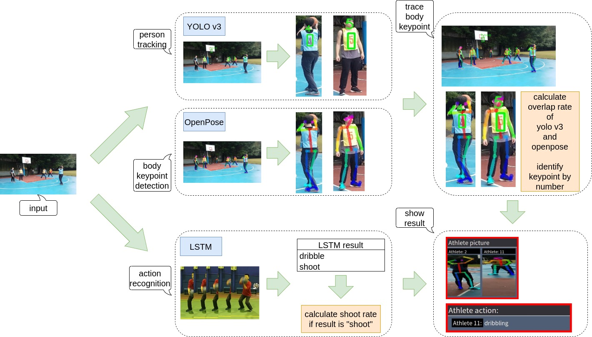

# Athlete analysis of real time sports events( AART )
[](https://travis-ci.com/ambersun1234/AART)
[](./LICENSE)


**AART** represents the real time athlete posture identification and tracking on video and webcam.

### Features
+ Real time athlete posture analysis
+ Real time athlete data analysis(e.g. shooting rate)
+ Real time athlete tracking system
+ User-friendly GUI interface
+ Auto-save sports competition highlight
+ Providing language system( Traditional Chinese , English )

### Clone repo
```=1
git clone https://github.com/ambersun1234/AART.git
```

### Running
```=1
make aart
```

## AART Neural Network Structure
+ 

### i18n
+ AART provide i18n language system, see the [documentation](./AART_project/src/gettextDocument.md) for detail

### System requirements
+ see [system requirements](./systemRequiremnts.md) file for detail

### Commit hooks
+ This github repository had installed **pre-commit hook** and **commit-msg hook**, please install *pycodestyle* by `sudo pip3 install pycodestyle`. Enable commit hooks by `make`, it will show something like `Git commit hooks are installed successfully.`

### Author
+ [ambersun1234](https://github.com/ambersun1234)
+ [louisme87](https://github.com/louisme87)

### Contributors
+ [Fofo](https://github.com/jr00138017)
+ [s1123527](https://github.com/s1123527)
+ [snowmintowo](https://github.com/snowmint)
+ [wayne6172](https://github.com/wayne6172)
+ u10506106@ms.ttu.edu.tw
+ u10506107@ms.ttu.edu.tw
+ u10506125@ms.ttu.edu.tw
+ u10506131@ms.ttu.edu.tw
+ u10506123@ms.ttu.edu.tw
+ u10506151@ms.ttu.edu.tw

### License
+ This project is licensed under AART license - see the [AART License](./LICENSE) file for detail
